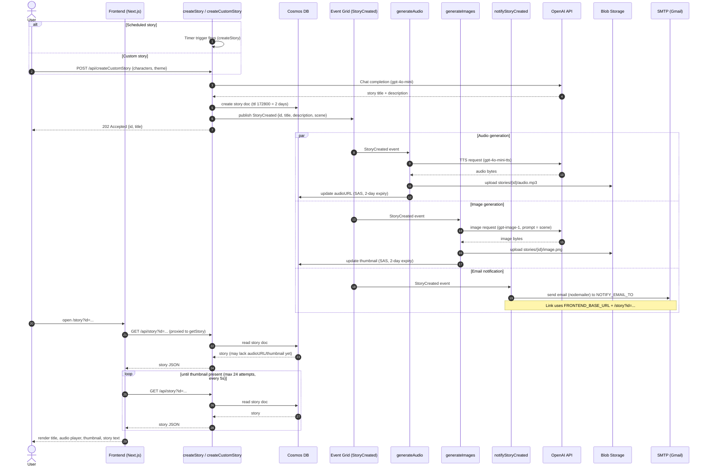
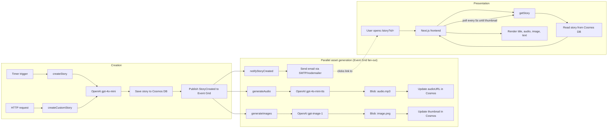

# App Workflow

This describes the end-to-end request/event flow for the Azure version of AI Stories, from story creation through frontend rendering and email notification.

## Sequence diagram

## Flowchart view

## Notes

- **Two ways to create a story**: the nightly `createStory` timer (uses all seeded characters + a random scene) or the on-demand `createCustomStory` HTTP endpoint (caller-supplied characters/theme, function-key protected since it costs real OpenAI calls).
- **Event Grid fan-out is 3-way**, not 2-way: `generateAudio`, `generateImages`, and `notifyStoryCreated` all subscribe independently to the same `StoryCreated` event and run concurrently.
- **Read-after-write race**: because asset generation is asynchronous, a user opening the story link right away may see text only. The frontend's `/api/story` proxy is polled client-side (every 5s, up to 24 attempts ≈ 2 minutes) until the thumbnail appears — this is what fixed the earlier "image never shows up" symptom.
- **Email link correctness**: `notifyStoryCreated` builds the story link from the `FRONTEND_BASE_URL` app setting — this must match the actual deployed frontend hostname for the given `prefix`/resource group (see [main.bicep](infra/main.bicep)).
- **TTL cleanup**: story documents in Cosmos DB have `ttl: 172800` (2 days), after which Cosmos automatically deletes them — matching the SAS token expiry on the blob assets.
