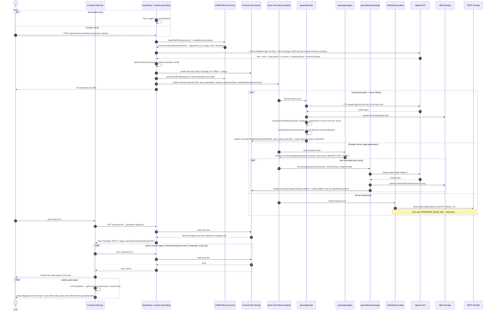

# App Workflow

This describes the end-to-end request/event flow for the Azure version of AI Stories, from story creation through frontend rendering and email notification.

## Sequence diagram

## Flowchart view

```mermaid
flowchart LR
    subgraph Creation
        Timer[Timer trigger] --> createStory
        HTTPReq[HTTP request] --> createCustomStory
        createStory --> LoadMemory[loadChildProfiles + buildMemoryContext]
        createCustomStory --> LoadMemory
        LoadMemory --> OpenAIText[OpenAI gpt-4o-mini: Story Package JSON incl. memoryUpdate]
        OpenAIText --> ParsePackage[safeParseStoryPackage: title, story, 6 scenes, characterSheet, memoryUpdate]
        ParsePackage --> SaveStory[Save Story Package to Cosmos DB]
        SaveStory --> UpsertMemory[upsertChildProfiles: merge memoryUpdate into childProfiles]
        SaveStory --> Publish[Publish StoryCreated to Event Grid]
    end

    subgraph "Parallel asset generation (Event Grid fan-out)"
        Publish --> generateAudio
        Publish --> generateImages
        Publish --> notifyStoryCreated
        generateAudio --> TTS[OpenAI gpt-4o-mini-tts: full story text] --> AudioBlob[Blob: audio.mp3]
        AudioBlob --> ExactOffsets[computeExactOffsets: proportional per-scene offsets by word count]
        ExactOffsets --> SsmlBuild[buildStorySsmlFromScenes: ssml with bookmarks]
        SsmlBuild --> UpdateAudio[Update scenes offsets + ssml + audio.audioURL in Cosmos]
        generateImages --> PublishSceneEvents["Publish SceneImageRequested per scene (up to 6)"]
        PublishSceneEvents -.-> generateSceneImage
        generateSceneImage --> ImageGen["OpenAI gpt-image-1 (scene.imagePrompt), one invocation per scene, parallel"] --> ImageBlob[Blob: images/scene-N.png] --> UpdateScenes[Update scenes-N-.imageUrl/status + assetsStatus in Cosmos]
        notifyStoryCreated --> Email[Send email via SMTP/nodemailer]
    end

    subgraph Presentation
        UserBrowser[User opens /story?id=] --> Frontend[Next.js frontend]
        Frontend --> getStory
        getStory --> ReadCosmos[Read Story Package from Cosmos DB]
        ReadCosmos --> Frontend
        Frontend -- "poll every 5s until a scene image/thumbnail" --> getStory
        Frontend --> Render[Render title, audio, story text]
        Render --> SyncScenes["onTimeUpdate -> getCurrentScene() -> swap scene image (using exact offsets)"]
    end

    Email -. "clicks link to" .-> UserBrowser
```

## Notes

- **Two ways to create a story**: the nightly `createStory` timer (uses all seeded characters + a random scene) or the on-demand `createCustomStory` HTTP endpoint (caller-supplied characters/theme, function-key protected since it costs real OpenAI calls). Both now generate a full **Story Package** (title, story, description, 6 scenes with image prompts, characterSheet, ttsInstructions, `memoryUpdate`) instead of a single title+description pair.
- **Persistent character memory (Fase 2)**: before prompting the LLM, both creation paths load each character's `childProfiles` document (keyed by a slugified name) and inject a memory block of recurring friends/places/elements plus the established `appearance`. The LLM's `memoryUpdate` response (new friends/places/elements introduced in this story) is merged back into the profile afterward (capped at 12 items per list, 20 story IDs) — this makes repeat characters feel continuous across many stories instead of starting fresh each time, without ever repeating the exact same plot.
- **Event Grid fan-out is 4-way**, not 3-way: `generateAudio`, `generateImages`, and `notifyStoryCreated` all subscribe to `StoryCreated` and run concurrently; `generateImages` then publishes a `SceneImageRequested` event per scene, which `generateSceneImage` subscribes to independently.
- **Parallel scene images (Fase 3)**: `generateImages` no longer generates images itself — it reads the Story Package's 6 scenes (capped by `IMAGES_PER_STORY`, default 6) and publishes one `SceneImageRequested` event per scene to Event Grid. Because Azure Functions dispatches each event to its own invocation, `generateSceneImage` processes all (up to 6) scenes **concurrently** instead of one function looping through them sequentially — significantly faster wall-clock time per story. A failed scene is marked `status: "failed"` and does not block the remaining scenes, the audio, or the story text; it can be retried by manually republishing that scene's `SceneImageRequested` event to the Event Grid topic. (A sequential in-process fallback still exists in `generateImages` for local/dev setups without an Event Grid topic configured.)
- **Exact audio/scene offsets (Fase 3)**: after synthesizing audio, `generateAudio` recomputes each scene's `startOffsetMs`/`endOffsetMs` proportionally to that scene's narration word count relative to the actual synthesized audio duration (`computeExactOffsets`) — replacing the LLM's rough fixed 15-20s-per-scene estimate with a tighter approximation. It also builds and stores an SSML document with per-scene `<bookmark>` tags (`buildStorySsmlFromScenes`) on the story's `ssml` field, ready for a future SSML-capable TTS provider (OpenAI's `gpt-4o-mini-tts` doesn't accept SSML input or return bookmark timestamps today).
- **Read-after-write race**: because asset generation is asynchronous, a user opening the story link right away may see text only. The frontend's `/api/story` proxy is polled client-side (every 5s, up to 24 attempts ≈ 2 minutes) until at least one scene image (or the legacy `thumbnail`) appears — this is what fixed the earlier "image never shows up" symptom.
- **Scene/audio sync**: once audio and images are available, the frontend tracks the `<audio>` element's `currentTime` and uses `getCurrentScene(scenes, currentTimeSeconds)` to pick the scene whose recomputed `startOffsetMs`/`endOffsetMs` window contains it, swapping the displayed image accordingly. This shows **one scene image at a time**, synced to playback progress (with dot indicators marking position) — by design, not a bug; all 6 scene images exist and are visited in turn as the audio plays.
- **Backwards compatibility**: `description`, `thumbnail`, and `audioURL` are still written/read on every story document, so any older client or tooling that only knows those three fields keeps working unchanged.
- **Email link correctness**: `notifyStoryCreated` builds the story link from the `FRONTEND_BASE_URL` app setting — this must match the actual deployed frontend hostname for the given `prefix`/resource group (see [main.bicep](infra/main.bicep)).
- **TTL cleanup**: story documents in Cosmos DB have `ttl: 172800` (2 days), after which Cosmos automatically deletes them — matching the SAS token expiry on the blob assets.
