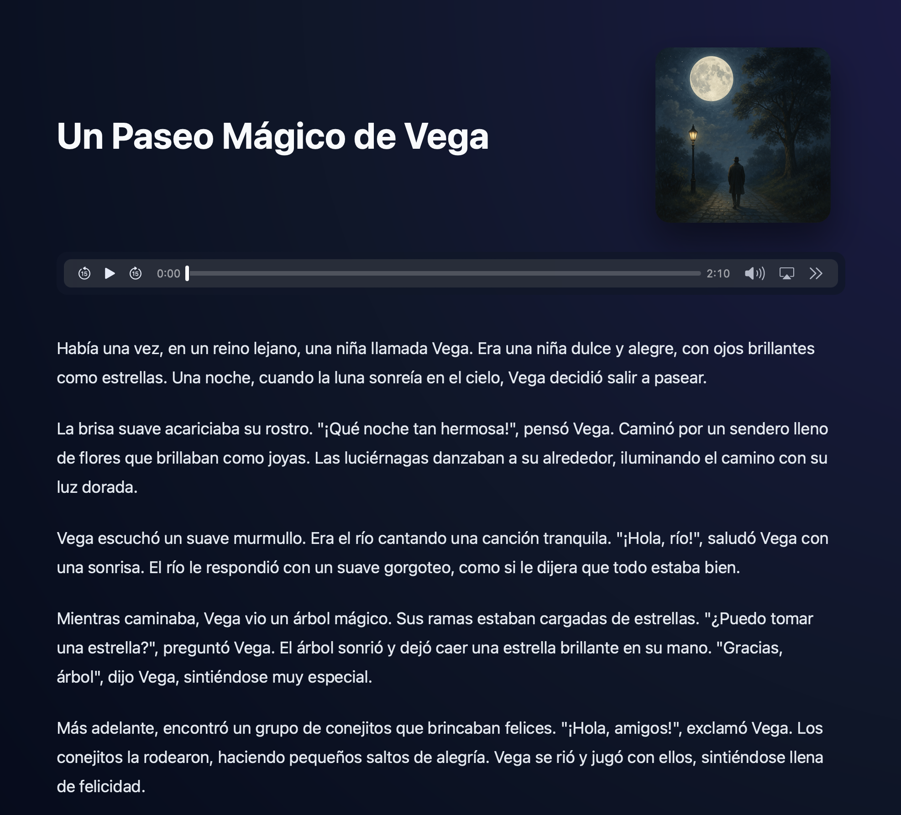
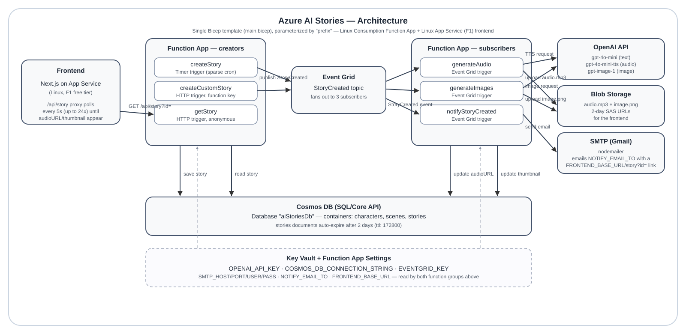

<div align="center">

<h1>📖 AI Generated Stories</h1>
<p>An event-driven application that generates a new bedtime story for your children using Azure Functions, Event Grid, Cosmos DB, App Service and OpenAI.</p>

<hr />



  <h3>Features: a new story on a schedule, narrated audio and a scene image generated by OpenAI, all produced from an event-driven architecture.</h3>

</div>

<hr/>

# Core Features

- ⏱️ [Azure Functions timer trigger](https://learn.microsoft.com/azure/azure-functions/functions-bindings-timer) to generate a new story on a configurable schedule
- 📦 Event-driven fan-out using [Azure Event Grid](https://learn.microsoft.com/azure/event-grid/overview) to trigger audio generation, image generation, and an email notification in parallel
- 🤖 Story text via OpenAI Chat Completions (`gpt-4o-mini`), narration via OpenAI TTS (`gpt-4o-mini-tts`), and a scene image via OpenAI Images (`gpt-image-1`)
- 📧 Email notification (via SMTP/nodemailer) with a link to the new story, sent as soon as it's created
- 🧑‍💻 Infrastructure as code with [Bicep](https://learn.microsoft.com/azure/azure-resource-manager/bicep/overview), deployed with the Azure CLI, parameterized by a `prefix` so the whole stack can be duplicated into a new resource group

# How it works



See also [WORKFLOW.md](./WORKFLOW.md) for a sequence-diagram walkthrough of the full request/event flow.

1. A [timer trigger](../azure/function-app/createStory/function.json) fires the `createStory` function on a configured schedule — or a caller invokes the `createCustomStory` HTTP function directly (see below) with custom character names and a theme.

2. Either function builds a gentle, bedtime-appropriate prompt (aimed at a 3-year-old audience, Disney-inspired, no scary/sad content) and calls OpenAI (`gpt-4o-mini`) to write the story:
   - `createStory` uses all characters from the `characters` Cosmos container and picks one random scene from the `scenes` container.
   - `createCustomStory` uses the caller-supplied character names and theme (falling back to a random seeded scene if no theme is given).

   Both save the story to Cosmos DB with a 2-day TTL (`ttl: 172800`) so old stories expire automatically.

3. Both functions publish a `StoryCreated` event to an Event Grid custom topic.

4. Event Grid fans the event out to three independent subscribers:
   - `generateAudio`: calls OpenAI's TTS endpoint (`gpt-4o-mini-tts`) to narrate the story, uploads the MP3 to Blob Storage, and updates the story document with a SAS-signed `audioURL` (valid 2 days).
   - `generateImages`: calls OpenAI Images (`gpt-image-1`) to generate a scene illustration using the story's `scene`/theme as the prompt, uploads the PNG to Blob Storage, and updates the story document with a SAS-signed `thumbnail` URL (valid 2 days).
   - `notifyStoryCreated`: emails `NOTIFY_EMAIL_TO` (via SMTP/nodemailer) with a link to the new story, built from the `FRONTEND_BASE_URL` app setting.

5. The frontend (Next.js, hosted on Azure App Service Linux) fetches the story through its own `/api/story` proxy (which calls the `getStory` HTTP function) and renders the text, audio player, and thumbnail. Because asset generation is asynchronous, the frontend renders the story text immediately and client-side polls `/api/story` every 5 seconds (up to 24 attempts) until the thumbnail appears.

# Design choices

This application was designed as a proof of concept. If you want to extract patterns for your own use, there are some design considerations to understand first.

The frontend serves whichever story ID you request; there's no listing page or user accounts, and email is the only notification channel (no push). If you wanted to scale this to many users you would need to add multi-tenancy, a story index/listing, and per-user notification preferences.

## Hosting the frontend application
The Next.js frontend is hosted on Azure App Service and talks to the backend through the `getStory` HTTP function. Stories have a 2-day TTL in Cosmos DB and are automatically removed after that window.

## Event Grid pub/sub
Once a story is created, Event Grid fans the `StoryCreated` event out to the audio and image generation functions concurrently. This can lead to a race condition where the user views the story before its audio/image are ready. The frontend handles this by rendering the story text immediately and showing the audio/image once (if) they appear on a later fetch. For a simple use case this is fine, but if you need stronger read-after-write guarantees, consider an aggregator/orchestrator pattern (e.g. Durable Functions).

## Cosmos DB containers
Three containers are used: `characters` and `scenes` (seed data, rarely updated) and `stories` (generated content, TTL-expired). This mirrors the original three-table design; if you need to support many concurrent users you'll want to revisit partitioning and access patterns.

## Story tone and customization
The shared prompt builder (`azure/function-app/shared/storyPrompt.ts`) targets a calming bedtime story for a 3-year-old — simple words, short soothing sentences, a happy ending, and a magical Disney-inspired setting, with nothing scary, sad, or intense. The default seed data (`azure/function-app/data/`) reflects this: whimsical characters (e.g. "Luna the Bunny", "Ember the Baby Dragon") and cozy scenes (moonlit lakes, cloud kingdoms, enchanted forests). For one-off custom stories with specific names/themes, use `createCustomStory` instead of waiting for the timer or editing seed data — see "Generating a story" below.

# Deploying

## Prerequisites

- An [OpenAI API key](https://platform.openai.com/overview) with billing/quota enabled and access to the `gpt-image-1` image model.
- Node.js and the Azure CLI (`az`) installed and logged in (`az login`).
- An Azure subscription and resource group to deploy into.

## Deploy the infrastructure

```bash
cd azure/infra
bash scripts/deploy.sh <resource-group> [location]
```

This deploys the Storage Account, Cosmos DB (SQL/Core API, free tier optional via `cosmosFreeTier`), Event Grid topic, Function App (Linux Consumption plan), frontend App Service (Linux, F1 free tier), and optionally Key Vault, via `main.bicep`. Note: Azure permanently ties a resource group + region to one OS type for Dynamic SKU Function App plans — if you need to switch a previously-Windows RG to Linux (or vice versa), deploy into a brand-new resource group instead.

> Deploying the Event Grid subscriptions requires the function app to already have its functions registered — see `azure/infra/README.md` for the two-phase `deployEventGridSubscriptions` flag if you're deploying from scratch.

## Configure secrets and settings

Most app settings (including `FRONTEND_BASE_URL`, computed from the `prefix`/frontend hostname) are already wired up in `main.bicep` and get (re-)applied on every deploy. The ones you must still supply as deployment parameters: `openAiApiKey`, `enableAiGeneration=true`, `smtpUser`/`smtpPass`/`notifyEmailTo` (for email notifications). Since the bicep `appSettings` array replaces rather than merges, avoid setting other values manually via the CLI unless you also add them to the template — otherwise they'll be wiped out on the next redeploy.

## Deploy the function app code

```bash
cd azure/function-app
npm install
npm run build
zip -r -q ../../function-app-deploy.zip . -x "*.git*"
az functionapp deployment source config-zip -g <resource-group> -n <function-app-name> --src ../../function-app-deploy.zip
```

## Seed characters and scenes

Upload the sample data in `azure/function-app/data/` into the `characters` and `scenes` Cosmos DB containers.

## Deploy the frontend

```bash
cd azure/frontend
npm install
npm run build
```

Deploy via `az webapp deployment source config-zip` (Oryx remote-builds the app when `SCM_DO_BUILD_DURING_DEPLOYMENT=true`), or host on Azure Static Web Apps.

# Generating a story

## Scheduled/default story (all seeded characters, random scene)

The `createStory` function is timer-triggered. By default the schedule in `azure/function-app/createStory/function.json` is intentionally sparse (to avoid unexpected OpenAI costs) — update the cron expression to run nightly once you're ready for continuous use.

You can also manually trigger it via the Azure Functions Admin API:

```bash
curl -X POST "https://<function-app-name>.azurewebsites.net/admin/functions/createStory" \
  -H "x-functions-key: <master-key>" -H "Content-Type: application/json" -d "{}"
```

## Custom story (specific names + theme, on demand)

Use the `createCustomStory` HTTP endpoint to generate a story with your own character names and theme, without touching seed data. It requires a function key (`x-functions-key`, not anonymous) since each call triggers real OpenAI costs:

```bash
curl -X POST "https://<function-app-name>.azurewebsites.net/api/createCustomStory" \
  -H "x-functions-key: <function-or-master-key>" -H "Content-Type: application/json" \
  -d '{"characters": ["Mia", "Theo"], "theme": "building a blanket fort with a friendly puppy and sharing warm milk before sleep"}'
```

- `characters`: required, array of 1-4 names.
- `theme`: optional; if omitted, a random scene from the seeded `scenes` container is used instead.

The response returns immediately (`202 Accepted`) with the new story's `id` and clean `title` — audio and image generation continue asynchronously in the background, same as the scheduled path. Poll `GET /api/story?id=<id>` until `audioURL`/`thumbnail` appear.

## Local, cost-free development

See [azure/README.md](README.md) for running the frontend against mock data (`USE_MOCK_DATA=true`) and keeping AI generation disabled (`ENABLE_AI_GENERATION=false`) while you develop.

## Security

See [CONTRIBUTING](../CONTRIBUTING.md#security-issue-notifications) for more information.

## License

This library is licensed under the MIT-0 License. See the LICENSE file.